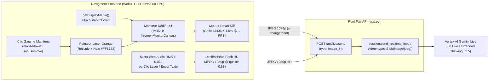

> 🌐 **Language / Langue :** [🇬🇧 English](./README.md) | **🇫🇷 Français**

# LivePulse — Vertex AI Gemini Live Real-Time Voice Console

**LivePulse** est une console vocale bidirectionnelle temps réel connectée à l'API **Google Cloud Vertex AI Gemini Live** (`gemini-3.8-live-preview`, `gemini-3.8-live`, `gemini-3.5-live-preview`, `gemini-3.1-live`), conçue avec une esthétique matérielle inspirée du design industriel **Braun / Dieter Rams / Teenage Engineering**.


**🚀 You can test it live here : [https://livepulse.fred-demo.net/](https://livepulse.fred-demo.net/)**

---

## ✨ Fonctionnalités Principales

* **Streaming Vocal Bidirectionnel Temps Réel (`16 kHz PCM IN` / `24 kHz PCM OUT`)** :
  * Capture microphone Web Audio API à `16 kHz` avec annulation d'écho, suppression de bruit et détection d'interruption naturelle (*Barge-in* temps réel).
  * Lecture audio `24 kHz` sans latence via file d'attente Web Audio et analyseur fréquentiel FFT.
* **Avatar Vocal Interactif 60 FPS (`MOD. A // AVATAR VOCAL INTERACTIF`)** :
  * Portrait studio animé à 60 FPS au centre de l'écran OLED avec synchronisation labiale (*lip-sync*) pilotée par les formants vocaux (`24 kHz`), clignement naturel des yeux et bascule automatique du genre (**Féminin** : `Aoede`, `Kore`, `Leda`, `Zephyr` / **Masculin** : `Puck`, `Charon`, `Fenrir`, `Orus`).
* **Co-Vision d'Écran en Temps Réel (`MOD. B // ÉCRAN PARTAGÉ` + Stratégie C + Pointeur Laser Orange)** :
  * Partagez à chaud n'importe quelle fenêtre, onglet ou écran complet sans redémarrer la session audio (`🖥️ PARTAGER ÉCRAN`).
  * **Stratégie Hybride C** : Envoie `1 FPS` (`1024p`) uniquement lorsque l'écran change de plus de `1 %` (`Smart Diff`), et injecte instantanément un cliché **Haute Définition (`1280p`)** dès que vous prenez la parole (`VOICE HD`), envoyez un message ou maintenez le clic enfoncé pour viser une zone avec le **pointeur laser orange interactif (`#FF5722`)**.
  * Sélecteur d'affichage (`[📺 ÉCRAN | 📜 TRANSCRIPTION]`) dans l'en-tête `MOD. B` permettant de basculer à 100 % entre le moniteur d'écran dédié et le ruban de transcription.
* **Outil Natif Google Search (`Grounding` Temps Réel)** :
  * Case à cocher sous les instructions système permettant d'activer ou de désactiver à chaud l'ancrage web `GoogleSearch()` pendant la session vocale, avec affichage en gris dans le ruban de transcription des requêtes exécutées et des sources web consultées.
* **Reconfiguration à Chaud dans le Ruban Supérieur (`REGION`, `MODEL`, `VOICE`)** :
  * Toute modification de la **Région** (`us-central1`, `europe-west1`, `europe-west4`, `europe-west9`), du **Modèle** (`gemini-3.8-live-preview`, `gemini-3.8-live-extended-thinking-preview`, `gemini-3.5-live-preview`, `gemini-3.1-live`, `gemini-live-2.5-flash-native-audio`) ou de la **Voix** redémarre automatiquement la session Live pour appliquer les nouveaux paramètres.
* **Pont Hybride HTTP-Live & WebSocket** :
  * Compatible à 100 % avec les proxies d'entreprise et Google Cloud Run (avec affinité de session).

---

## 🏗️ Architecture du Projet

```text
.
├── app.py                              # Backend FastAPI + Pont Vertex AI Gemini Live (google-genai SDK)
├── run_servers.py                      # Lanceur local dual-stack (HTTP :8765 + HTTPS auto-signé :8766)
├── Dockerfile                          # Image de production durcie (Python 3.12-slim, utilisateur non-root)
├── requirements.txt                    # Dépendances de production épinglées
├── requirements-dev.txt                # Outils de test et d'audit de sécurité (pytest, bandit, pip-audit)
├── static/
│   ├── index.html                      # Interface matérielle LivePulse
│   ├── styles.css                      # Design system industriel Braun / Teenage Engineering
│   ├── app.js                          # Moteur Web Audio 16k/24k + Avatar 60 FPS + Client Live
│   └── avatar_*.jpg                    # Keyframes studio 1024x1024 (idle, speaking, blink - F/M)
├── tests/
│   └── test_app.py                     # Suite de tests fonctionnels & d'en-têtes de sécurité (Pytest)
├── scripts/
│   └── setup_gcp_cicd.sh               # Script d'initialisation GCP (WIF, Artifact Registry, IAM)
└── .github/workflows/
    └── ci-cd-cloudrun.yml              # Pipeline CI/CD GitHub Actions (Tests + Sécurité -> Cloud Run)
```

---

## 🖥️ Co-Vision d'Écran en Temps Réel & Pointeur Laser Orange (`Stratégie C`)

LivePulse vous permet de partager une fenêtre, un onglet de navigateur ou votre écran complet (`🖥️ PARTAGER ÉCRAN`) **à chaud pendant une conversation vocale, sans redémarrer la session Gemini Live**.



### 1. Stratégie de Capture Hybride (`Stratégie C` : `1 FPS Smart Diff` + `Flash HD à la Voix / Laser`)
* **Veille Visuelle Économe (`1 FPS Smart Diff`)** :
  * Toutes les `1000 ms`, `computeScreenDiffPercent()` échantillonne l'écran partagé sur une grille de luminance `64×36` et la compare à l'image précédente.
  * Si la différence visuelle est **`< 1,0 %`** (écran immobile), **aucune image n'est envoyée** afin d'économiser la bande passante et les jetons de contexte.
  * Dès que vous faites défiler une page, changez d'onglet ou modifiez un graphique (`≥ 1,0 %` d'écart), une image `1024p` (qualité JPEG `0.72`) est transmise automatiquement.
* **Cliché Haute Définition (`1280p`, qualité `0.88`) Synchronisé à la Parole & au Laser** :
  * Dès que l'analyseur Web Audio détecte que **vous commencez à parler au micro** (`rms > 0.022`, `VOICE HD`), ou lorsque vous **maintenez le clic pour viser avec le pointeur laser** (`LASER HD`), ou lorsque vous **envoyez un message texte** (`TEXT HD`), un cliché **JPEG Haute Définition `1280p`** est capturé et injecté en priorité dans le flux actif de Gemini Live afin qu'il puisse lire les petits caractères, tableaux ou blocs de code avec une netteté maximale.

### 2. Option `UI1` : Moniteur Dédié 100 % dans `MOD. B` & Commutateur d'Affichage
* Dès l'activation du partage d'écran, le panneau de droite (`MOD. B`) bascule à **100 %** sur le Moniteur Vidéo OLED dédié (`#screenMonitorContainer`) avec télémétrie en direct (`LIVE VISION // 1 FPS DIFF + HD VOICE`, `FRAMES: N (HD)`).
* Un commutateur d'onglets (**`[📺 ÉCRAN | 📜 TRANSCRIPTION]`**) apparaît dans l'en-tête `MOD. B`, vous permettant de basculer à tout moment entre **100 % Moniteur d'Écran** et **100 % Ruban de Transcription** sans interrompre le flux vidéo.

### 3. Pointeur Laser Orange Interactif au Clic Maintenu (`#FF5722`)
* **Maintenez le clic gauche enfoncé (`mousedown` + `mousemove`)** n'importe où sur le moniteur d'écran partagé dans `MOD. B` pour faire apparaître le **pointeur laser orange Braun (`#FF5722`)** accompagné de son halo lumineux et de son réticule de visée.
* Ce pointeur laser est **gravé directement dans l'image JPEG `1280p` envoyée à Gemini**, ce qui permet de poser des questions spatiales naturelles telles que : *« Que penses-tu de l'anomalie que je te pointe juste ici ? »*.
* Dès que vous **relâchez le bouton de la souris** (`mouseup` / `mouseleave`), le pointeur laser **disparaît immédiatement** pour laisser les images suivantes parfaitement propres.

---

## 🚀 Exécution en Local

### 1. Prérequis
* Python `3.11+` ou `3.12+`
* Authentification Google Cloud Application Default Credentials (ADC) :
  ```bash
  gcloud auth application-default login
  export GOOGLE_CLOUD_PROJECT="votre-projet-gcp"
  ```

### 2. Installation & Démarrage
```bash
python3 -m venv venv
source venv/bin/activate
pip install -r requirements-dev.txt

# Lancer le serveur (HTTP sur :8765 et HTTPS sur :8766)
python run_servers.py
```
Ouvrez ensuite **`http://localhost:8765`** (ou **`https://localhost:8766`**).

---

## 🔐 Sécurité & Configuration des Secrets GitHub Actions

### Bonnes Pratiques DevSecOps Appliquées
1. **Zéro identifiant GCP en dur dans le code ou le workflow YAML** :
   * Aucun `PROJECT_ID`, `PROJECT_NUMBER` ni email de `Service Account` n'est stocké en clair dans le dépôt Git.
   * Toutes les valeurs sensibles d'infrastructure sont injectées via **GitHub Actions Encrypted Secrets** (`${{ secrets.* }}`), ce qui les masque automatiquement (`***`) dans les journaux de build.
2. **Authentification Sans Clé (Workload Identity Federation OIDC)** :
   * Aucune clé JSON de compte de service n'est créée (`constraints/iam.disableServiceAccountKeyCreation` respecté).
3. **Moindre Privilège (Least Privilege IAM) & Conteneur Non-Root** :
   * Séparation stricte entre le compte de déploiement CI/CD (`github-cicd-deployer`) et le compte d'exécution Cloud Run (`livepulse-runtime-sa`, limité à `roles/aiplatform.user` et `roles/logging.logWriter`).

### Tableau des 6 Secrets GitHub Actions
Dans votre dépôt GitHub (**Settings → Secrets and variables → Actions → Repository secrets**), les 6 secrets suivants alimentent [`.github/workflows/ci-cd-cloudrun.yml`](.github/workflows/ci-cd-cloudrun.yml) :

| Nom du Secret GitHub | Description |
| :--- | :--- |
| `GCP_PROJECT_ID` | Identifiant du projet Google Cloud cible |
| `GCP_REGION` | Région de déploiement Cloud Run & Artifact Registry (ex. `europe-west4`) |
| `GCP_WIF_PROVIDER` | Ressource complète du fournisseur Workload Identity (`projects/<NUM>/locations/global/workloadIdentityPools/github-pool/providers/github-provider`) |
| `GCP_DEPLOYER_SA` | Email du Service Account utilisé par GitHub Actions pour builder et déployer |
| `GCP_RUNTIME_SA` | Email du Service Account attaché au conteneur Cloud Run en production |
| `CUSTOM_DOMAIN` | *(Optionnel)* Nom de domaine personnalisé associé au service Cloud Run (ex. `livepulse.example.com`) |

### Nom de Domaine Personnalisé, Load Balancer HTTPS Global, Google Cloud IAP & Mise à Jour de Cloud DNS
En production, **LivePulse** est protégé par **Google Cloud Identity-Aware Proxy (IAP)** derrière un **Global External Application Load Balancer (HTTPS)** relié à un **Serverless NEG** (`europe-west4`), tandis que le service Cloud Run est verrouillé avec `--ingress=internal-and-cloud-load-balancing` et `--invoker-iam-check`.

Pour configurer votre sous-domaine, activer **Cloud IAP** et mettre à jour **Google Cloud DNS** depuis votre terminal (en utilisant des variables d'environnement afin de ne jamais stocker votre nom de domaine ou de zone DNS en clair dans le dépôt Git) :

1. **Réserver une adresse IPv4 globale statique & créer le certificat SSL managé par Google** :
   ```bash
   export CUSTOM_DOMAIN="livepulse.example.com"
   export GCP_PROJECT_ID="votre-projet-cloudrun"
   export GCP_REGION="europe-west4"

   gcloud compute addresses create livepulse-lb-ip --ip-version=IPV4 --global --project="${GCP_PROJECT_ID}"
   export LB_IP=$(gcloud compute addresses describe livepulse-lb-ip --global --project="${GCP_PROJECT_ID}" --format="value(address)")

   gcloud compute ssl-certificates create livepulse-ssl-cert --domains="${CUSTOM_DOMAIN}" --global --project="${GCP_PROJECT_ID}"
   ```
2. **Ajouter ou Mettre à Jour l'enregistrement `A` dans Google Cloud DNS** :
   Faites pointer votre sous-domaine (`${CUSTOM_DOMAIN}.` avec un point final) vers l'adresse IP statique du Load Balancer (`${LB_IP}`) dans le projet GCP qui héberge votre zone publique Cloud DNS :
   ```bash
   export DNS_PROJECT_ID="votre-projet-dns"
   export DNS_ZONE_NAME="votre-zone-cloud-dns"

   # Supprimer l'éventuel enregistrement CNAME précédent
   gcloud dns record-sets delete "${CUSTOM_DOMAIN}." --type="CNAME" --zone="${DNS_ZONE_NAME}" --project="${DNS_PROJECT_ID}" --quiet || true

   # Créer l'enregistrement A pointant vers l'IP du Load Balancer HTTPS Global
   gcloud dns record-sets create "${CUSTOM_DOMAIN}." \
     --type="A" \
     --ttl="300" \
     --rrdatas="${LB_IP}" \
     --zone="${DNS_ZONE_NAME}" \
     --project="${DNS_PROJECT_ID}"
   ```
3. **Activer Google Cloud IAP & Autoriser les Domaines / Utilisateurs** :
   ```bash
   gcloud iap web enable --resource-type=backend-services --service=livepulse-backend-service --project="${GCP_PROJECT_ID}"

   # Accorder le rôle roles/iap.httpsResourceAccessor aux domaines ou comptes autorisés
   gcloud iap web add-iam-policy-binding \
     --resource-type=backend-services \
     --service=livepulse-backend-service \
     --member="domain:example.com" \
     --role="roles/iap.httpsResourceAccessor" \
     --project="${GCP_PROJECT_ID}"
   ```

### Bootstrap Initial de l'Infrastructure GCP
Pour provisionner automatiquement Artifact Registry, les Service Accounts et Workload Identity Federation sur un nouveau projet GCP :

```bash
export GCP_PROJECT_ID="votre-projet-gcp"
export GCP_PROJECT_NUMBER="123456789012"
export GCP_REGION="europe-west4"
export GITHUB_REPO="votre-org/livepulse"

./scripts/setup_gcp_cicd.sh
```

---

## ⚙️ Fonctionnement Détaillé du Workflow GitHub Actions (`ci-cd-cloudrun.yml`)

Le pipeline CI/CD défini dans [`.github/workflows/ci-cd-cloudrun.yml`](.github/workflows/ci-cd-cloudrun.yml) automatise la validation qualité/sécurité et la mise en production sur **Google Cloud Run**.

### 1. Schéma d'Exécution du Pipeline

```mermaid
flowchart LR
    A["Push / PR sur main\nou déclenchement manuel"] --> B["Job 1 : test-and-security"]
    subgraph CI ["Intégration Continue (Validation Qualité & Sécurité)"]
        B --> B1["Pytest\n(Tests fonctionnels & UI)"]
        B1 --> B2["Bandit SAST\n(Audit sécurité code Python)"]
        B2 --> B3["Pip-Audit OSV\n(Scan CVE dépendances)"]
    end
    B3 -->|Succès + Branche main| C["Job 2 : deploy-cloudrun"]
    subgraph CD ["Déploiement Continu (Google Cloud Run)"]
        C --> C1["Auth OIDC sans clé\n(Workload Identity Federation)"]
        C1 --> C2["Docker Build & Push\n(Artifact Registry)"]
        C2 --> C3["Déploiement Cloud Run\n(Service Account Runtime)"]
        C3 --> C4["Smoke Test HTTP\n(GET /api/health == ok)"]
    end
```



### 2. Déclencheurs (`on:`)
* **`push` sur la branche `main`** : Exécute l'intégralité du pipeline (**Job 1** puis **Job 2**).
* **`pull_request` vers `main`** : Exécute uniquement le **Job 1 (`test-and-security`)** pour valider le code avant fusion, sans déployer en production.
* **`workflow_dispatch`** : Permet de relancer manuellement le pipeline depuis l'onglet **Actions** de GitHub.

### 3. Étape par Étape : Les 2 Jobs du Workflow

#### 🧪 Job 1 : `1. Functional Tests & Security Audit` (`test-and-security`)
Ce premier job agit comme un **garde-fou bloquant** (*Quality & Security Gate*). Si l'une des 3 vérifications échoue, le pipeline s'arrête immédiatement et le déploiement Cloud Run est annulé :
1. **Tests Fonctionnels & UI (`python -m pytest tests/ -v`)** :
   * Vérifie que l'endpoint de santé `GET /api/health` répond `200 OK`.
   * Vérifie la présence des en-têtes HTTP de sécurité (`X-Content-Type-Options: nosniff`, `X-Frame-Options: SAMEORIGIN`) et des règles anti-cache (`Cache-Control: no-store`).
   * Vérifie l'intégrité de l'interface HTML (`LIVEPULSE`, sélecteurs `REGION`, `MODEL`, `VOICE`) et la disponibilité des 6 images clés de l'avatar 60 FPS.
   * Simule un cycle complet de session vocale (`/api/live/start` → `/api/live/poll` → `/api/live/send` → `/api/live/stop`).
2. **Analyse Statique de Sécurité du Code (`bandit -r app.py -ll -ii`)** :
   * Analyse l'arbre syntaxique (AST) de `app.py` pour détecter toute faille de sécurité potentielle (injections, exécution de commandes, secrets en dur, configurations TLS/WebSocket risquées) de sévérité moyenne ou haute.
3. **Audit des Vulnérabilités de Dépendances (`pip-audit -r requirements.txt --vulnerability-service osv`)** :
   * Interroge la base de données publique **Google OSV (Open Source Vulnerabilities)** pour vérifier qu'aucune bibliothèque listée dans `requirements.txt` (`fastapi`, `uvicorn`, `google-genai`, `pydantic`, `websockets`) ne comporte de faille CVE connue.

#### 🚀 Job 2 : `2. Build & Deploy to Cloud Run` (`deploy-cloudrun`)
Ce second job ne démarre que si **`needs: test-and-security`** est réussi **et** que l'exécution a lieu sur la branche `refs/heads/main` :
1. **Authentification OIDC Sans Clé (`google-github-actions/auth@v2`)** :
   * GitHub Actions génère un jeton OIDC éphémère (`id-token: write`) signé pour le dépôt et la branche `main`.
   * Google Cloud **Workload Identity Federation** (`secrets.GCP_WIF_PROVIDER`) vérifie la condition `assertion.repository == 'frederic-bouy/livepulse' && assertion.ref == 'refs/heads/main'` et accorde un jeton d'accès temporaire au compte de service déployeur (`secrets.GCP_DEPLOYER_SA`).
2. **Construction & Publication du Conteneur (`Docker Build & Push`)** :
   * Construit l'image Docker multi-couches ([`Dockerfile`](Dockerfile)) exécutée sous l'utilisateur non-root `appuser`.
   * Tagge l'image avec l'empreinte exacte du commit (`:${{ github.sha }}`) ainsi que `:latest`, puis la pousse dans Google Artifact Registry (`${{ secrets.GCP_REGION }}-docker.pkg.dev/.../livepulse-repo/livepulse`).
3. **Déploiement sur Cloud Run (`gcloud run deploy`)** :
   * Déploie la nouvelle révision sur Cloud Run avec `2 vCPU`, `1 GiB RAM`, affinité de session (`--session-affinity`), timeout de `3600s` pour les sessions vocales longues, et associe le compte de service d'exécution à moindre privilège (`secrets.GCP_RUNTIME_SA`).
4. **Vérification Post-Déploiement (`Smoke Test`)** :
   * Récupère l'URL HTTPS publique du service Cloud Run déployé et appelle `GET ${SERVICE_URL}/api/health` pour confirmer que le nouveau conteneur répond `"status":"ok"` en production.
