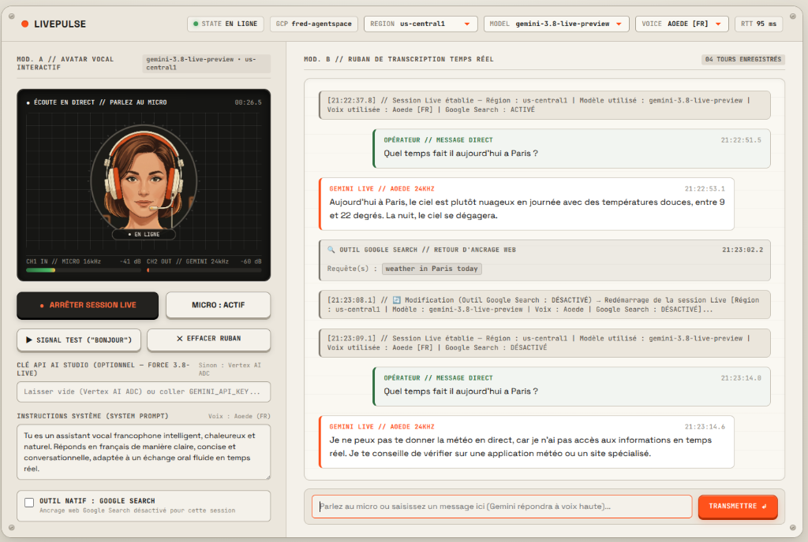
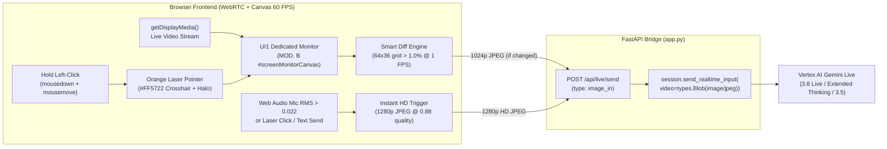

> 🌐 **Language / Langue :** **🇬🇧 English** | [🇫🇷 Français](./README.fr.md)

# LivePulse — Vertex AI Gemini Live Real-Time Voice Console

**LivePulse** is a real-time bidirectional voice console connected to the **Google Cloud Vertex AI Gemini Live API** (`gemini-3.8-live-preview`, `gemini-3.8-live`, `gemini-3.5-live-preview`, `gemini-3.1-live`), designed with a tactile hardware aesthetic inspired by **Braun / Dieter Rams / Teenage Engineering** industrial design.



---

## ✨ Key Features

* **Real-Time Bidirectional Voice Streaming (`16 kHz PCM IN` / `24 kHz PCM OUT`)**:
  * Web Audio API `16 kHz` microphone capture with echo cancellation, noise suppression, and natural real-time interruption (*Barge-in*) detection.
  * Zero-latency `24 kHz` audio playback with Web Audio scheduling and FFT frequency analysis.
* **60 FPS Interactive Voice Avatar (`MOD. A // AVATAR VOCAL INTERACTIF`)**:
  * 60 FPS studio portrait rendered at the center of the OLED display with real-time formant-driven lip-sync (`24 kHz`), natural eye blinking, and automatic gender switching (**Female**: `Aoede`, `Kore`, `Leda`, `Zephyr` / **Male**: `Puck`, `Charon`, `Fenrir`, `Orus`).
* **Real-Time Screen Co-Vision (`MOD. B // ÉCRAN PARTAGÉ` + Strategy C + Orange Laser Pointer)**:
  * Share any window, browser tab, or full screen live without restarting the audio session (`🖥️ PARTAGER ÉCRAN`).
  * **Hybrid Strategy C**: Streams `1 FPS` (`1024p`) only when visual changes exceed `1%` (`Smart Diff`), and automatically injects an instant `1280p HD` frame as soon as you start speaking (`VOICE HD`), send a text message, or hold the mouse button down to point with the **interactive orange laser pointer (`#FF5722`)**.
  * Includes a `MOD. B` header switcher (`[📺 ÉCRAN | 📜 TRANSCRIPTION]`) to toggle 100% between the live screen monitor and the conversation transcript tape.
* **Native Google Search Tool (Real-Time Web Grounding)**:
  * Interactive checkbox below the system instructions allowing you to enable or disable native `GoogleSearch()` web grounding on the fly, rendering executed search queries and cited web sources in gray directly inside the transcript tape.
* **Hot-Swappable Top Ribbon Controls (`REGION`, `MODEL`, `VOICE`)**:
  * Changing the **Region** (`us-central1`, `europe-west1`, `europe-west4`, `europe-west9`), **Model** (`gemini-3.8-live-preview`, `gemini-3.8-live-extended-thinking-preview`, `gemini-3.5-live-preview`, `gemini-3.1-live`, `gemini-live-2.5-flash-native-audio`), or **Voice** automatically restarts the active Live session to apply the new configuration immediately.
* **Hybrid HTTP-Live & WebSocket Bridge**:
  * 100% compatible with corporate HTTP proxies and Google Cloud Run (with session affinity).

---

## 🏗️ Project Architecture

```text
.
├── app.py                              # FastAPI Backend + Vertex AI Gemini Live Bridge (google-genai SDK)
├── run_servers.py                      # Local dual-stack launcher (HTTP :8765 + self-signed HTTPS :8766)
├── Dockerfile                          # Hardened production image (Python 3.12-slim, non-root user)
├── requirements.txt                    # Pinned production dependencies
├── requirements-dev.txt                # Testing & security audit tooling (pytest, bandit, pip-audit)
├── static/
│   ├── index.html                      # LivePulse hardware console UI
│   ├── styles.css                      # Braun / Teenage Engineering industrial design system
│   ├── app.js                          # Web Audio 16k/24k engine + 60 FPS Avatar + Live client
│   └── avatar_*.jpg                    # 1024x1024 studio keyframes (idle, speaking, blink - F/M)
├── tests/
│   └── test_app.py                     # Functional & security header test suite (Pytest)
├── scripts/
│   └── setup_gcp_cicd.sh               # GCP bootstrap script (WIF, Artifact Registry, IAM)
└── .github/workflows/
    └── ci-cd-cloudrun.yml              # GitHub Actions CI/CD Pipeline (Tests + Security -> Cloud Run)
```

---

## 🖥️ Real-Time Screen Co-Vision & Interactive Orange Laser Pointer (`Strategy C`)

LivePulse allows you to share a window, browser tab, or full screen (`🖥️ PARTAGER ÉCRAN`) **on the fly during an active voice conversation without restarting the Gemini Live session**.



### 1. Hybrid Capture Strategy (`Strategy C`: `1 FPS Smart Diff` + `Instant Voice/Laser HD`)
* **Background Visual Awareness (`1 FPS Smart Diff`)**:
  * Every `1000 ms`, `computeScreenDiffPercent()` downsamples the shared screen onto an offscreen `64×36` luminance grid and compares it with the previous frame.
  * If the visual difference is **`< 1.0%`** (static screen), **zero frames are transmitted** to save bandwidth and context tokens.
  * As soon as you scroll, switch tabs, or update a chart (`≥ 1.0%` pixel delta), a `1024p` (`0.72` JPEG quality) frame is streamed automatically.
* **Instant High-Definition (`1280p`, `0.88` quality) Trigger on Speech & Laser**:
  * As soon as the Web Audio microphone analyser detects that **you start speaking** (`rms > 0.022`, `VOICE HD`), or when you **hold the mouse button to point with the laser** (`LASER HD`), or when you **send a text message** (`TEXT HD`), an immediate **`1280p` High-Definition JPEG** is captured and injected into the active Gemini Live stream so the model can read fine typography, code, or tables with maximum clarity.

### 2. Option `UI1`: Dedicated `MOD. B` Screen Monitor & View Switcher
* When screen sharing starts, the right panel (`MOD. B`) switches **100%** to the dedicated OLED Screen Monitor (`#screenMonitorContainer`) with live telemetry (`LIVE VISION // 1 FPS DIFF + HD VOICE`, `FRAMES: N (HD)`).
* A header tab switcher (**`[📺 ÉCRAN | 📜 TRANSCRIPTION]`**) appears in `MOD. B`, allowing you to toggle at any time between **100% Screen Monitor** and **100% Transcription Tape** without interrupting the video stream.

### 3. Hold-to-Point Interactive Orange Laser Pointer (`#FF5722`)
* **Hold Left-Click (`mousedown` + `mousemove`)** anywhere on the shared screen monitor in `MOD. B` to activate the **Braun Orange Laser Pointer (`#FF5722`)** with a glowing target reticle.
* The laser pointer is **burned directly into the `1280p` JPEG frame sent to Gemini**, enabling natural spatial questions such as *"What do you think of the anomaly I'm pointing at right here?"*.
* Releasing the mouse button (`mouseup` / `mouseleave`) **immediately hides the laser pointer** so subsequent frames remain clean.

---

## 🚀 Running Locally

### 1. Prerequisites
* Python `3.11+` or `3.12+`
* Google Cloud Application Default Credentials (ADC):
  ```bash
  gcloud auth application-default login
  export GOOGLE_CLOUD_PROJECT="your-gcp-project"
  ```

### 2. Installation & Startup
```bash
python3 -m venv venv
source venv/bin/activate
pip install -r requirements-dev.txt

# Start local servers (HTTP on :8765 and HTTPS on :8766)
python run_servers.py
```
Then open **`http://localhost:8765`** (or **`https://localhost:8766`**).

---

## 🔐 Security & GitHub Actions Secrets Configuration

### Applied DevSecOps Best Practices
1. **Zero Hardcoded GCP Identifiers in Code or Workflow YAML**:
   * No `PROJECT_ID`, `PROJECT_NUMBER`, or `Service Account` email is stored in plaintext in the Git repository.
   * All sensitive infrastructure values are injected via **GitHub Actions Encrypted Secrets** (`${{ secrets.* }}`), automatically masking them (`***`) in build logs.
2. **Keyless Authentication (Workload Identity Federation OIDC)**:
   * Zero long-lived JSON service account keys (`constraints/iam.disableServiceAccountKeyCreation` compliant).
3. **Least-Privilege IAM & Non-Root Container**:
   * Strict separation between the CI/CD deployment service account (`github-cicd-deployer`) and the Cloud Run runtime service account (`livepulse-runtime-sa`, restricted to `roles/aiplatform.user` and `roles/logging.logWriter`).

### GitHub Actions Secrets Table
In your GitHub repository (**Settings → Secrets and variables → Actions → Repository secrets**), configure the following 6 secrets used by [`.github/workflows/ci-cd-cloudrun.yml`](.github/workflows/ci-cd-cloudrun.yml):

| GitHub Secret Name | Description |
| :--- | :--- |
| `GCP_PROJECT_ID` | Target Google Cloud Project ID |
| `GCP_REGION` | Cloud Run & Artifact Registry region (e.g., `europe-west4`) |
| `GCP_WIF_PROVIDER` | Full Workload Identity Provider resource name (`projects/<NUM>/locations/global/workloadIdentityPools/github-pool/providers/github-provider`) |
| `GCP_DEPLOYER_SA` | Service Account email used by GitHub Actions to build and deploy |
| `GCP_RUNTIME_SA` | Least-privilege Service Account email attached to the Cloud Run service |
| `CUSTOM_DOMAIN` | *(Optional)* Custom FQDN mapped to the Cloud Run service (e.g., `livepulse.example.com`) |

### Custom Domain, Global HTTPS Load Balancer, Cloud IAP & Updating Google Cloud DNS
In production, **LivePulse** is protected by **Google Cloud Identity-Aware Proxy (IAP)** behind a **Global External Application Load Balancer (HTTPS)** connected to a **Serverless NEG** (`europe-west4`), while the Cloud Run service is locked down with `--ingress=internal-and-cloud-load-balancing` and `--invoker-iam-check`.

To configure the custom domain, enable **Cloud IAP**, and update **Google Cloud DNS** from your terminal (using environment variables so no domain or DNS zone identifiers are hardcoded in the repository):

1. **Reserve a Global Static IPv4 Address & Provision the Google-Managed SSL Certificate**:
   ```bash
   export CUSTOM_DOMAIN="livepulse.example.com"
   export GCP_PROJECT_ID="your-cloudrun-project"
   export GCP_REGION="europe-west4"

   gcloud compute addresses create livepulse-lb-ip --ip-version=IPV4 --global --project="${GCP_PROJECT_ID}"
   export LB_IP=$(gcloud compute addresses describe livepulse-lb-ip --global --project="${GCP_PROJECT_ID}" --format="value(address)")

   gcloud compute ssl-certificates create livepulse-ssl-cert --domains="${CUSTOM_DOMAIN}" --global --project="${GCP_PROJECT_ID}"
   ```
2. **Add or Update the `A` Record in Google Cloud DNS**:
   Point your custom subdomain (`${CUSTOM_DOMAIN}.` with a trailing dot) to the Load Balancer static IP (`${LB_IP}`) in the GCP project that hosts your Cloud DNS managed zone:
   ```bash
   export DNS_PROJECT_ID="your-dns-host-project"
   export DNS_ZONE_NAME="your-cloud-dns-zone"

   # Delete any previous CNAME record if switching from Cloud Run Domain Mapping
   gcloud dns record-sets delete "${CUSTOM_DOMAIN}." --type="CNAME" --zone="${DNS_ZONE_NAME}" --project="${DNS_PROJECT_ID}" --quiet || true

   # Create the A record pointing to the Global HTTPS Load Balancer IP
   gcloud dns record-sets create "${CUSTOM_DOMAIN}." \
     --type="A" \
     --ttl="300" \
     --rrdatas="${LB_IP}" \
     --zone="${DNS_ZONE_NAME}" \
     --project="${DNS_PROJECT_ID}"
   ```
3. **Enable Google Cloud IAP & Authorize Users/Domains**:
   ```bash
   gcloud iap web enable --resource-type=backend-services --service=livepulse-backend-service --project="${GCP_PROJECT_ID}"

   # Grant roles/iap.httpsResourceAccessor to authorized domains or users
   gcloud iap web add-iam-policy-binding \
     --resource-type=backend-services \
     --service=livepulse-backend-service \
     --member="domain:example.com" \
     --role="roles/iap.httpsResourceAccessor" \
     --project="${GCP_PROJECT_ID}"
   ```

### Initial GCP Infrastructure Bootstrap
To automatically provision Artifact Registry, Service Accounts, and Workload Identity Federation on a new GCP project:

```bash
export GCP_PROJECT_ID="your-gcp-project"
export GCP_PROJECT_NUMBER="123456789012"
export GCP_REGION="europe-west4"
export GITHUB_REPO="your-org/livepulse"

./scripts/setup_gcp_cicd.sh
```

---

## ⚙️ Detailed GitHub Actions Workflow (`ci-cd-cloudrun.yml`)

The CI/CD pipeline defined in [`.github/workflows/ci-cd-cloudrun.yml`](.github/workflows/ci-cd-cloudrun.yml) automates quality/security verification and continuous deployment to **Google Cloud Run**.

### 1. Pipeline Execution Diagram

```mermaid
flowchart LR
    A["Push / PR on main\nor manual trigger"] --> B["Job 1: test-and-security"]
    subgraph CI ["Continuous Integration (Quality & Security Gate)"]
        B --> B1["Pytest\n(Functional & UI tests)"]
        B1 --> B2["Bandit SAST\n(Python static security scan)"]
        B2 --> B3["Pip-Audit OSV\n(Dependency CVE scan)"]
    end
    B3 -->|Success + main branch| C["Job 2: deploy-cloudrun"]
    subgraph CD ["Continuous Deployment (Google Cloud Run)"]
        C --> C1["Keyless OIDC Auth\n(Workload Identity Federation)"]
        C1 --> C2["Docker Build & Push\n(Artifact Registry)"]
        C2 --> C3["Cloud Run Deploy\n(Runtime Service Account)"]
        C3 --> C4["HTTP Smoke Test\n(GET /api/health == ok)"]
    end
```



### 2. Triggers (`on:`)
* **`push` to `main`**: Runs the full pipeline (**Job 1** followed by **Job 2**).
* **`pull_request` targeting `main`**: Runs **Job 1 (`test-and-security`)** only to validate changes before merging without deploying to production.
* **`workflow_dispatch`**: Allows manual execution from the GitHub **Actions** tab.

### 3. Step-by-Step: The 2 Workflow Jobs

#### 🧪 Job 1: `1. Functional Tests & Security Audit` (`test-and-security`)
Acts as a **blocking Quality & Security Gate**. If any check fails, the pipeline stops immediately and cancels deployment:
1. **Functional & UI Tests (`python -m pytest tests/ -v`)**:
   * Verifies `GET /api/health` returns `200 OK`.
   * Verifies HTTP security headers (`X-Content-Type-Options: nosniff`, `X-Frame-Options: SAMEORIGIN`) and anti-caching headers (`Cache-Control: no-store`).
   * Verifies HTML UI integrity (`LIVEPULSE`, `REGION`, `MODEL`, `VOICE` selectors, and `googleSearchToggle`) and all 6 studio avatar keyframes.
   * Simulates a full live session lifecycle (`/api/live/start` → `/api/live/poll` → `/api/live/send` → `/api/live/stop`).
2. **Static Application Security Testing (`bandit -r app.py -ll -ii`)**:
   * Scans the Python AST of `app.py` for medium/high-severity security issues (injections, unsafe subprocess calls, hardcoded secrets, insecure TLS/WebSocket settings).
3. **Dependency Vulnerability Audit (`pip-audit -r requirements.txt --vulnerability-service osv`)**:
   * Queries the **Google OSV (Open Source Vulnerabilities)** database to verify that no library in `requirements.txt` (`fastapi`, `uvicorn`, `google-genai`, `pydantic`, `websockets`) has known CVEs.

#### 🚀 Job 2: `2. Build & Deploy to Cloud Run` (`deploy-cloudrun`)
Starts only if **`needs: test-and-security`** succeeds **and** the commit is on `refs/heads/main`:
1. **Keyless OIDC Authentication (`google-github-actions/auth@v2`)**:
   * GitHub Actions generates an ephemeral signed OIDC token (`id-token: write`) for the repository and `main` branch.
   * Google Cloud **Workload Identity Federation** (`secrets.GCP_WIF_PROVIDER`) verifies `assertion.repository == 'frederic-bouy/livepulse' && assertion.ref == 'refs/heads/main'` and grants a short-lived access token for the deployer service account (`secrets.GCP_DEPLOYER_SA`).
2. **Container Build & Publish (`Docker Build & Push`)**:
   * Builds the multi-layer Docker image ([`Dockerfile`](Dockerfile)) running under the non-root `appuser` account.
   * Tags the image with both the exact commit SHA (`:${{ github.sha }}`) and `:latest`, then pushes it to Google Artifact Registry (`${{ secrets.GCP_REGION }}-docker.pkg.dev/.../livepulse-repo/livepulse`).
3. **Cloud Run Deployment (`gcloud run deploy`)**:
   * Deploys the new revision to Cloud Run with `2 vCPU`, `1 GiB RAM`, `--session-affinity`, `3600s` request timeout for long voice sessions, and attaches the least-privilege runtime service account (`secrets.GCP_RUNTIME_SA`).
4. **Post-Deployment Smoke Test (`Smoke Test`)**:
   * Retrieves the public HTTPS Cloud Run service URL and queries `GET ${SERVICE_URL}/api/health` to confirm `"status":"ok"` in production.
